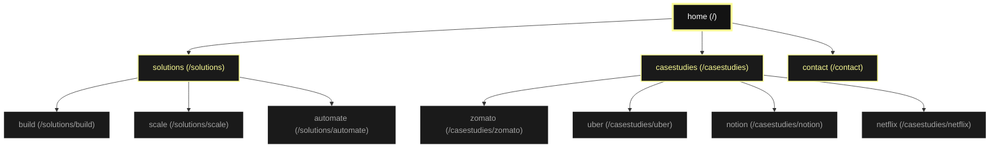

# Kriya Information Architecture & Sitemap

> **Last updated:** June 2026  
> This document reflects the **actual deployed routes** in the live codebase.  
> The previous version was outdated — `/work`, `/insights`, and `/solutions/ai` have been removed.

---

## 1. Visual Sitemap



---

## 2. Structural Breakdown

### `/` — Homepage
Entry point. Full-screen Bento Grid layout with:
- **Hero block** — "Everything web. we do." with floating tech icons
- **Solutions block** — Build / Scale / Automate preview grid
- **Case Studies block** — Zomato / Uber / Notion / Netflix preview grid

---

### `/solutions` — Solutions Overview
Landing page listing all three service pillars with links to each.

#### `/solutions/build` — Build
Web Development · App Development · UI/UX Engineering  
Tech: React, Next.js, Astro, Flutter, Figma

#### `/solutions/scale` — Scale
Digital Marketing · SEO · Meta Ads · Brand Building  
Tech: Google Ads, Google Search Console, Meta, Adobe Illustrator

#### `/solutions/automate` — Automate
AI/ML Integration · WhatsApp Automation · Workflow Intelligence  
Tech: OpenAI, WhatsApp Business API

---

### `/casestudies` — Case Studies
Landing page listing all four published case studies.

#### `/casestudies/zomato`
Challenge: Food delivery order surge & real-time tracking latency  
Stack: Node.js, WebSockets, Redis, Kubernetes

#### `/casestudies/uber`
Challenge: High-density map rendering & driver matching at scale  
Stack: Mapbox GL JS, Go microservices, gRPC, H3 geospatial indexing

#### `/casestudies/notion`
Challenge: Offline-first sync & conflict resolution in collaborative docs  
Stack: Yjs CRDTs, IndexedDB, WebSockets, Node.js Hub Servers

#### `/casestudies/netflix`
Challenge: Startup buffering latency & adaptive video streaming  
Stack: HLS/MPEG-DASH, Edge Workers, Cloudflare, Web Workers

---

### `/contact` — Contact
Contact form with WhatsApp deep-link CTA. Inquiry categories map to the three solution pillars.

---

## 3. Navigation Structure

### Desktop Nav (DesktopNav.astro)
```
[Logo]     Solutions ▾   Case Studies   Contact     [Start Building →]
                │
                ├── Build
                ├── Scale
                └── Automate
```

### Mobile Canvas (MobileCanvas.tsx) — 4 Slides
```
Slide 1: Home         → Kriya branding + hero CTA
Slide 2: Solutions    → Build / Scale / Automate cards
Slide 3: Case Studies → Zomato / Uber / Notion / Netflix cards
Slide 4: Contact      → WhatsApp / email CTA
```

### Footer (Footer.astro)
```
Kriya Hubs:   Solutions Ecosystem | Case Studies | Contact Us
Kriya Legal:  Terms & Conditions | Privacy Notice | Refund & Cancellation
Connect:      Contact Portal
Social:       X · Instagram · YouTube · GitHub
```

---

## 4. Removed Routes (Historical Reference)

> ⚠️ These routes no longer exist. Do NOT link to them.

| Route | Reason Removed |
|-------|---------------|
| `/work` | Renamed and restructured as `/casestudies` |
| `/work/casestudy` | Replaced by `/casestudies/*` individual pages |
| `/insights` | Removed — not part of current scope |
| `/insights/blog` | Never built |
| `/insights/whitepaper` | Never built |
| `/solutions/ai` | Renamed to `/solutions/automate` |

---

## 5. Planned / Future Routes

> Not yet built. Add here when scoped.

| Route | Purpose |
|-------|---------|
| `/corporate/privacy-notice` | Privacy policy page |
| `/corporate/dpa` | Data Processing Agreement |
| `/corporate/grievance-redressal` | Refund & Cancellation policy |
