# Kriya Information Architecture & Sitemap

This blueprint outlines the complete Information Architecture (IA) for Kriya. It strictly adheres to the Three-Click Rule, user mental models, SEO best practices against cannibalization, and DPDP Act compliance requirements.

## Architectural Principles Enforced:
1. **Three-Click Rule**: The deepest content page is strictly Level 3.
2. **Mental Models**: Services are grouped by business objectives (Build, Scale, Automate), not internal departments.
3. **Nomenclature**: Human services use `Kriya [Service]`, proprietary software uses `Kriya-[Noun]`.
4. **Compliance**: Dedicated space for DPDP mechanisms, DPAs, and Privacy features.

---

## 1. Visual Sitemap (Mermaid.js Blueprint)

```mermaid
graph TD
    %% Level 1: Root Domain
    Root["Level 1: Kriya Root Domain (Home)"]

    %% Level 2: Primary Navigation Hubs
    Root --> Hub1["Solutions (Services Ecosystem)"]
    Root --> Hub3["Work (Proof of Capability)"]
    Root --> Hub4["Insights (Knowledge Hub)"]
    Root --> Hub5["Company & Legal (Utility)"]

    %% Level 3: Solutions
    Hub1 --> Sol_Build["Build: Kriya Web | Kriya App | Kriya UI/UX"]
    Hub1 --> Sol_Scale["Scale: Kriya Growth | Kriya SEO | Kriya Social | Kriya Brand"]
    Hub1 --> Sol_Auto["Automate: Kriya AI"]



    %% Level 3: Work
    Hub3 --> Work_Cases["Interactive Case Studies"]
    Hub3 --> Work_Demos["Live SaaS Demonstrations"]

    %% Level 3: Insights
    Hub4 --> Ins_Blog["Engineering & Strategy Blog"]
    Hub4 --> Ins_Whitepapers["Technical Whitepapers"]

    %% Level 3: Company & Legal
    Hub5 --> Corp_Contact["Contact Portal"]
    Hub5 --> Corp_Privacy["Dynamic Privacy Notice (DPDP)"]
    Hub5 --> Corp_DPA["Vendor DPAs"]
    Hub5 --> Corp_Grievance["Grievance Redressal Mechanism"]

    classDef rootFill fill:#0F172A,stroke:#4F46E5,stroke-width:4px,color:#fff;
    classDef hubFill fill:#4F46E5,stroke:#06B6D4,stroke-width:2px,color:#fff;
    classDef leafFill fill:#F8FAFC,stroke:#1E293B,stroke-width:1px,color:#0F172A;
    classDef complianceFill fill:#EC4899,stroke:#9D174D,stroke-width:2px,color:#fff;

    class Root rootFill;
    class Hub1,Hub3,Hub4,Hub5 hubFill;
    class Sol_Build,Sol_Scale,Sol_Auto,Work_Cases,Work_Demos,Ins_Blog,Ins_Whitepapers leafFill;
    class Corp_Contact,Corp_Privacy,Corp_DPA,Corp_Grievance complianceFill;
```

---

## 2. Structural Breakdown (Directory Format)

### Level 1: `kriya.digital/` (Root)
*The primary entry point prioritizing direct routing to the four central hubs.*

### Level 2: `/solutions/` (Ecosystem of Services Hub)
*Organized via Task-Oriented Mental Models.*
* **Level 3: `/solutions/build/`** (Digital Architecture & Infrastructure)
  * `Kriya Web`: High-performance web platforms.
  * `Kriya App`: Native and cross-platform ecosystem engineering.
  * `Kriya UI/UX`: Interface architecture & user research.
* **Level 3: `/solutions/scale/`** (Audience & Market Expansion)
  * `Kriya Growth`: Digital marketing and performance funnels.
  * `Kriya SEO`: Technical and semantic search optimization.
  * `Kriya Social`: Community architecture and social media management.
  * `Kriya Brand`: Digital identity and market positioning.
* **Level 3: `/solutions/automate/`** (Intelligence & Workflows)
  * `Kriya AI`: Machine learning integration and automated systems.

### Level 2: `/work/` (Proof of Capability Hub)
*Engineered for visual validation.*
* **Level 3: `/work/case-studies/`** (Interactive client success stories)
* **Level 3: `/work/live-demos/`** (Sandboxed environments for Kriya SaaS tools)

### Level 2: `/insights/` (Knowledge Hub)
*Engineered for Thought Leadership & Semantic SEO.*
* **Level 3: `/insights/engineering-blog/`** (Technical breakdowns and Kriya workflows)
* **Level 3: `/insights/whitepapers/`** (Deep-dive research on AI, growth, and development)

### Level 2: `/corporate/` (Utility & Compliance Hub)
*Clearly mapped to satisfy DPDP Act regulations.*
* **Level 3: `/corporate/contact/`** (Unified Contact Portal)
* **Level 3: `/corporate/privacy-notice/`** (Dynamic Privacy Notice mapping PII usage)
* **Level 3: `/corporate/dpa/`** (Vendor Data Processing Agreements)
* **Level 3: `/corporate/grievance-redressal/`** (Dedicated mechanism for data subjects)
